# 💪 Daily Motivation Bot

> A production-ready, serverless FastAPI service that sends beautiful, AI-generated motivational quotes in French via email every morning at 6:30 AM.

[](https://fastapi.tiangolo.com/)
[](https://www.python.org/)
[](https://render.com/)
[](LICENSE)

---

## 📖 About This Project

**Daily Motivation Bot** is an automated email service that delivers personalized, AI-generated motivational quotes in French every morning. Built with a serverless architecture, it runs entirely on Render's free tier without requiring a 24/7 running server.

### What It Does

Every day at 6:30 AM (Europe/Paris time), the bot:
1. 🤖 Generates a unique motivational quote using Groq's LLM API
2. 🎨 Creates a beautiful HTML email with modern styling
3. 📧 Sends the email to multiple recipients simultaneously
4. ✨ Ensures each day brings fresh inspiration

### Key Highlights

- **🚀 Serverless Architecture**: No need to keep servers running 24/7
- **🤖 AI-Powered**: Uses Groq's Llama 3.1 model for intelligent quote generation
- **📧 Multi-Recipient**: Send to multiple email addresses with one API call
- **🎨 Beautiful Emails**: Professional HTML templates with gradient designs
- **⚡ Fast & Efficient**: Built with FastAPI for high performance
- **💰 Free Tier Friendly**: Works perfectly on Render's free tier

---

## ✨ Features

- 🤖 **AI-Powered Quotes**: Uses Groq LLM API (Llama 3.1-8b-instant) to generate famous motivational quotes in French
- 🎨 **Beautiful HTML Emails**: Stunning gradient design with modern, inspiring styling and responsive layout
- 📧 **Yahoo SMTP Integration**: Reliable email delivery via Yahoo SMTP with app password authentication
- 🚀 **FastAPI Backend**: Clean, modern REST API with proper error handling and documentation
- ⏰ **Serverless Automation**: Designed to work with Render Cron Jobs for automated daily sending
- 🔄 **Daily Variety**: Each day generates a different quote using date-based prompts
- 👥 **Multi-Recipient Support**: Send to multiple email addresses simultaneously
- 📱 **Mobile-Friendly**: Responsive email design that looks great on all devices

---

## 🏗️ Architecture & Flow

### System Flow Diagram

The following diagram illustrates how the FastAPI application interacts with external services:

```mermaid
sequenceDiagram
    participant Cron as Render Cron Job
    participant API as FastAPI Application
    participant Groq as Groq LLM API
    participant SMTP as Yahoo SMTP Server
    participant User as Email Recipient

    Note over Cron: Daily at 06:30 (Europe/Paris)
    Cron->>API: POST /send-daily-love-email
    
    API->>API: Validate request & config
    API->>Groq: Generate motivational quote<br/>(with date-based prompt)
    Groq-->>API: Return AI-generated quote
    
    API->>API: Build HTML email template<br/>(with quote & styling)
    API->>SMTP: Send email via SMTP<br/>(HTML + plain text)
    SMTP-->>API: Email sent confirmation
    SMTP->>User: Deliver motivational email 💌
    
    API-->>Cron: Return success response<br/>(status, recipient, quote)
```



### System Components


---

## 🛠️ Tech Stack

- **Backend Framework**: [FastAPI](https://fastapi.tiangolo.com/) - Modern, fast web framework
- **AI/LLM**: [Groq API](https://console.groq.com/) - Llama 3.1-8b-instant model
- **Email**: Yahoo SMTP - Reliable email delivery
- **Deployment**: [Render](https://render.com/) - Serverless hosting with Cron Jobs
- **Language**: Python 3.11+
- **Dependencies**: See [requirements.txt](requirements.txt)

---

## 📁 Project Structure

```
daily-motivation-bot/
├── app/
│   ├── __init__.py
│   ├── main.py              # FastAPI application & endpoints
│   ├── config.py            # Environment configuration
│   ├── utils.py             # Utility functions
│   ├── models/
│   │   ├── __init__.py
│   │   └── schemas.py        # Pydantic models
│   ├── services/
│   │   ├── __init__.py
│   │   ├── groq_client.py   # Groq API integration
│   │   └── email_service.py  # SMTP email service
│   └── templates/
│       ├── __init__.py
│       └── email_templates.py  # HTML email templates
├── requirements.txt         # Python dependencies
├── render.yaml              # Render deployment config
├── .gitignore              # Git ignore rules
└── README.md               # This file
```

---

## 🚀 Quick Start

### Prerequisites

- Python 3.11 or higher
- A Yahoo email account (for SMTP)
- A Groq API key ([Get one here](https://console.groq.com/))

### 1. Clone the Repository

```bash
git clone https://github.com/yourusername/daily-motivation-bot.git
cd daily-motivation-bot
```

### 2. Install Dependencies

```bash
pip install -r requirements.txt
```

### 3. Set Up Environment Variables

Create a `.env` file in the project root:

```env
SMTP_HOST=smtp.mail.yahoo.com
SMTP_PORT=587
SMTP_USER=your_email@yahoo.com
SMTP_PASSWORD=your_yahoo_app_password
RECIPIENT_EMAILS=recipient1@example.com,recipient2@example.com
SENDER_NAME=Your Name
GROQ_API_KEY=your_groq_api_key
```

**Important Notes:**
- `SMTP_PASSWORD` must be a **Yahoo App Password**, not your regular Yahoo password
- To generate a Yahoo App Password: Yahoo Account → Security → Generate App Password
- `RECIPIENT_EMAILS` should be comma-separated (no spaces): `email1@example.com,email2@example.com`
- Get your Groq API key from [https://console.groq.com](https://console.groq.com)

### 4. Run Locally

```bash
uvicorn app.main:app --reload
```

The API will be available at `http://127.0.0.1:8000`

### 5. Test the Endpoint

**Test with all configured recipients:**
```bash
curl -X POST "http://127.0.0.1:8000/send-daily-love-email" \
  -H "Content-Type: application/json" \
  -d '{}'
```

**Test with a specific recipient:**
```bash
curl -X POST "http://127.0.0.1:8000/send-daily-love-email" \
  -H "Content-Type: application/json" \
  -d '{"to_email": "test@example.com"}'
```

**View API Documentation:**
- Swagger UI: http://127.0.0.1:8000/docs
- ReDoc: http://127.0.0.1:8000/redoc

---

## 📡 API Endpoints

### `GET /`

Health check endpoint.

**Response:**
```json
{
  "message": "Daily Motivation Bot API is running 💪"
}
```

### `POST /send-daily-love-email`

Generates a motivational quote and sends it via email to all configured recipients.

**Request Body (optional):**
```json
{
  "to_email": "custom@example.com"
}
```

- If `to_email` is provided, sends only to that address
- If `to_email` is not provided, sends to all emails in `RECIPIENT_EMAILS`

**Response:**
```json
{
  "status": "ok",
  "sent_to": "recipient1@example.com, recipient2@example.com",
  "quote": "La vie est un cadeau, chaque jour est un nouveau départ pour créer l'excellence. — Les Brown ✨"
}
```

**Error Responses:**
- `400`: Missing recipient email
- `500`: Error generating quote or sending email

---

## ☁️ Deployment on Render

This application is designed for serverless deployment on Render using Cron Jobs. Follow these steps:

### Step 1: Push to GitHub

1. Initialize git repository (if not already done):
   ```bash
   git init
   git add .
   git commit -m "Initial commit: Daily Motivation Bot"
   ```

2. Push to GitHub:
   ```bash
   git remote add origin https://github.com/yourusername/daily-motivation-bot.git
   git push -u origin main
   ```

### Step 2: Create Web Service on Render

1. Go to [Render Dashboard](https://dashboard.render.com)
2. Click **"New +"** → **"Web Service"**
3. Connect your GitHub repository
4. Configure the service:
   - **Name**: `daily-motivation-bot` (or your preferred name)
   - **Environment**: `Python 3`
   - **Build Command**: `pip install -r requirements.txt`
   - **Start Command**: `uvicorn app.main:app --host 0.0.0.0 --port $PORT`
   - **Plan**: Free tier is fine for this use case

### Step 3: Set Environment Variables

In the Render dashboard, go to your service → **Environment** tab, and add:

```
SMTP_HOST=smtp.mail.yahoo.com
SMTP_PORT=587
SMTP_USER=your_email@yahoo.com
SMTP_PASSWORD=your_yahoo_app_password
RECIPIENT_EMAILS=mehdigribaa10@yahoo.com,raniachemli07@gmail.com
SENDER_NAME=Mehdi ❤️
GROQ_API_KEY=your_groq_api_key
```

**Important**: 
- `RECIPIENT_EMAILS` should be a comma-separated list (no spaces)
- `SMTP_PASSWORD` must be a **Yahoo App Password**
- Get your Groq API key from [https://console.groq.com](https://console.groq.com)

### Step 4: Create Cron Job (Serverless Automation)

This application uses a **serverless architecture** where Render Cron Job triggers the endpoint daily. The app doesn't need to stay running 24/7.

1. In Render dashboard, click **"New +"** → **"Cron Job"**
2. Configure:
   - **Name**: `daily-motivation-email`
   - **Schedule**: `30 5 * * *` (06:30 Europe/Paris = 05:30 UTC)
   - **Command**: 
     ```bash
     curl -X POST "https://YOUR-SERVICE-URL.onrender.com/send-daily-love-email" \
       -H "Content-Type: application/json" \
       -d '{}'
     ```
   - Replace `YOUR-SERVICE-URL` with your actual Render service URL (e.g., `daily-motivation-bot.onrender.com`)
   - **Plan**: Free tier is fine

**How it works**:
- The Cron Job calls your API endpoint every day at 6:30 AM (Europe/Paris time)
- The endpoint generates a quote and sends emails to all recipients in `RECIPIENT_EMAILS`
- The app wakes up automatically when called (even on free tier)
- No need for the app to run 24/7 - truly serverless! 🚀

**Note**: To convert Europe/Paris time to UTC:
- 06:30 Europe/Paris (CET) = 05:30 UTC (winter)
- 06:30 Europe/Paris (CEST) = 04:30 UTC (summer)
- For simplicity, you can use `30 5 * * *` which is 05:30 UTC (06:30 CET)

### Step 5: Test Manually

Once deployed, test the endpoint:

```bash
curl -X POST "https://YOUR-RENDER-URL.onrender.com/send-daily-love-email" \
  -H "Content-Type: application/json" \
  -d '{"to_email": "your_test_email@example.com"}'
```

### ⚠️ Important: Free Tier & Serverless Architecture

**This app uses a serverless architecture with Render Cron Jobs.**

**How it works:**
- The Cron Job automatically wakes up your service when it runs
- There might be a 30-60 second delay on the first request after spin-down (cold start)
- This is normal and expected behavior on the free tier
- No need to keep the service running 24/7 - it's truly serverless! 🎉

**Optional: Keep Service Warm (if needed)**
If you want to eliminate cold start delays, you can:
1. **Use UptimeRobot** (free): Set up a monitor to ping your service every 5 minutes
   - Go to [uptimerobot.com](https://uptimerobot.com)
   - Add a monitor for your Render URL
   - Set interval to 5 minutes
   - This keeps your service alive 24/7

2. **Upgrade to Starter plan** ($7/month): Services stay always-on

---

## 🎨 Email Design

The email template features:
- ✨ Soft gradient background (inspiring pink/rose tones)
- 📅 Date pill at the top showing current date in French
- 💪 Beautiful card design with rounded corners and shadows
- 📱 Fully responsive (mobile-friendly)
- 🎯 Clean, modern typography
- ✨ Professional and inspiring styling

---

## 🔧 Configuration

### Environment Variables

| Variable | Description | Required | Default |
|----------|-------------|----------|---------|
| `SMTP_HOST` | Yahoo SMTP host | No | `smtp.mail.yahoo.com` |
| `SMTP_PORT` | SMTP port | No | `587` |
| `SMTP_USER` | Yahoo email address | **Yes** | - |
| `SMTP_PASSWORD` | Yahoo app password | **Yes** | - |
| `RECIPIENT_EMAILS` | Comma-separated recipient emails | **Yes** | - |
| `SENDER_NAME` | Display name for sender | No | `Mehdi` |
| `GROQ_API_KEY` | Groq API key | **Yes** | - |
| `SCHEDULE_HOUR` | Hour for scheduled emails (not used with Cron Job) | No | `6` |
| `SCHEDULE_MINUTE` | Minute for scheduled emails (not used with Cron Job) | No | `30` |

**Note**: `RECIPIENT_EMAILS` should be a comma-separated list like: `email1@example.com,email2@example.com` (no spaces)

---

## 🐛 Troubleshooting

### Email Not Sending

1. **Check Yahoo App Password**: Make sure you're using an App Password, not your regular password
2. **Verify SMTP credentials**: Test with a simple SMTP connection
3. **Check Render logs**: View logs in Render dashboard for error messages
4. **Verify recipient emails**: Ensure `RECIPIENT_EMAILS` is correctly formatted (comma-separated, no spaces)

### Groq API Errors

1. **Verify API Key**: Make sure `GROQ_API_KEY` is set correctly
2. **Check API Limits**: Groq has rate limits on free tier
3. **View logs**: Check console output for detailed error messages
4. **Test API connection**: Verify your API key works by testing directly with Groq

### Cron Job Not Running

1. **Verify Schedule**: Double-check the cron expression (`30 5 * * *`)
2. **Test Endpoint**: Manually call the endpoint to ensure it works
3. **Check Render Cron Logs**: View execution logs in Render dashboard
4. **Verify URL**: Make sure the Cron Job command uses the correct service URL

### Service Not Waking Up

1. **Check Cold Start**: First request after spin-down may take 30-60 seconds
2. **Verify Cron Job**: Ensure the Cron Job is actually running (check logs)
3. **Test Manually**: Try calling the endpoint manually to verify it works

---

## 🤝 Contributing

Contributions are welcome! Feel free to:
- Open an issue for bugs or feature requests
- Submit a pull request with improvements
- Share feedback and suggestions

---

## 📝 License

This project is open source and available for personal use.

---

## 💝 Made with Love

Built to spread daily love and motivation. Start each day with inspiration! 🩷

**Enjoy your daily dose of motivation!** 💪✨
